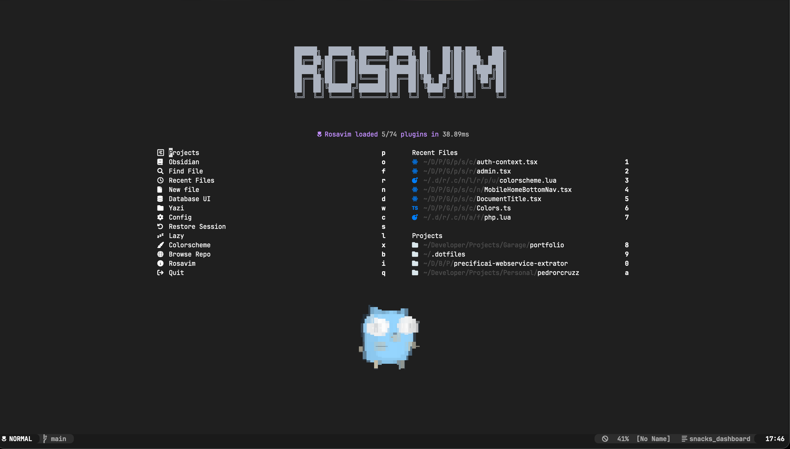
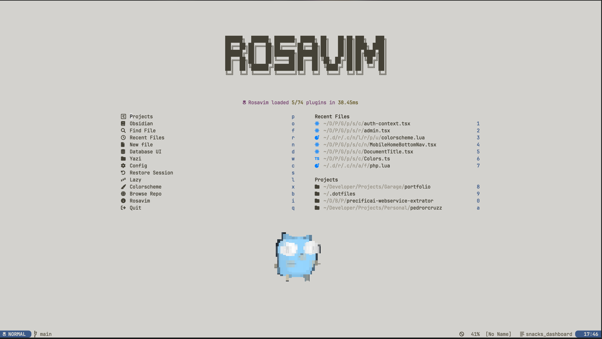
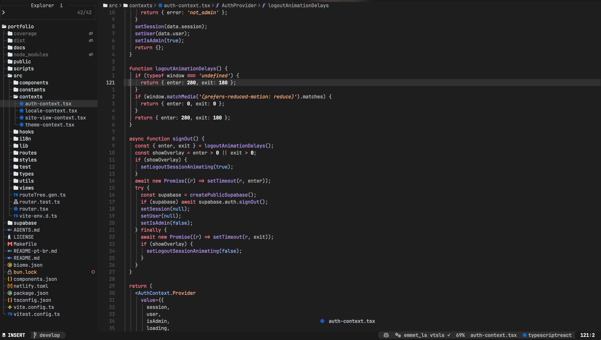
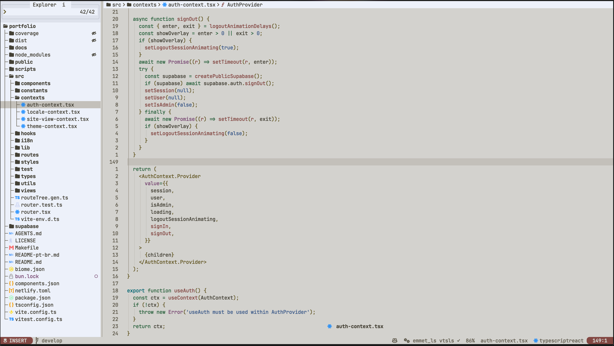
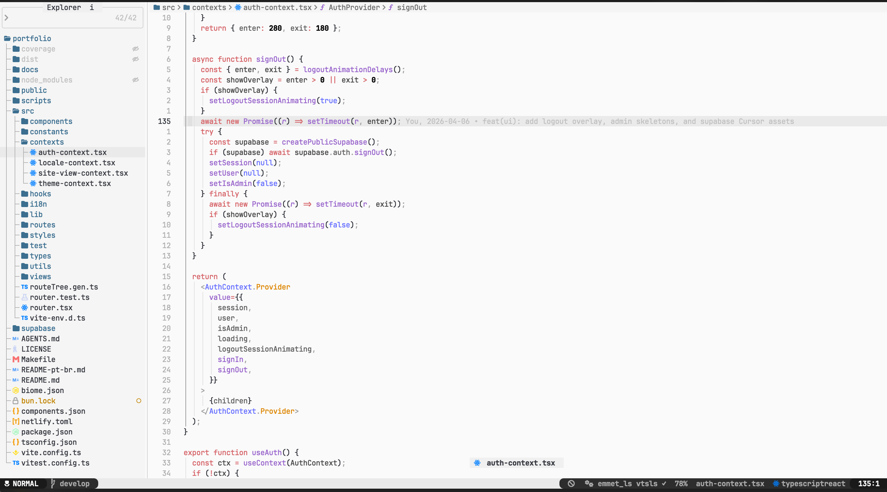
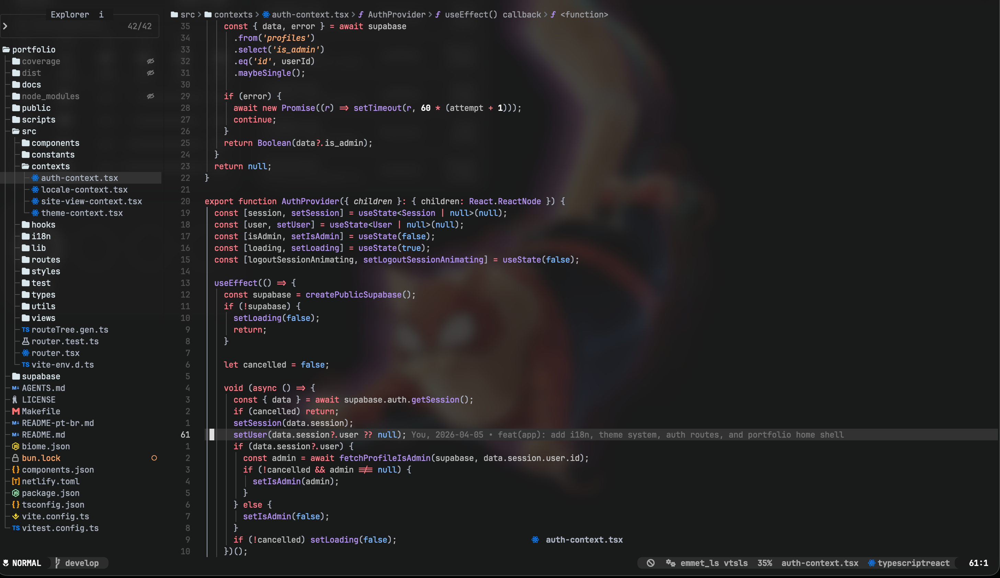
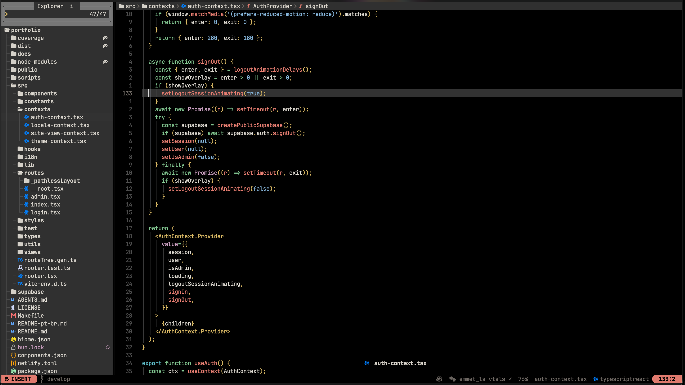
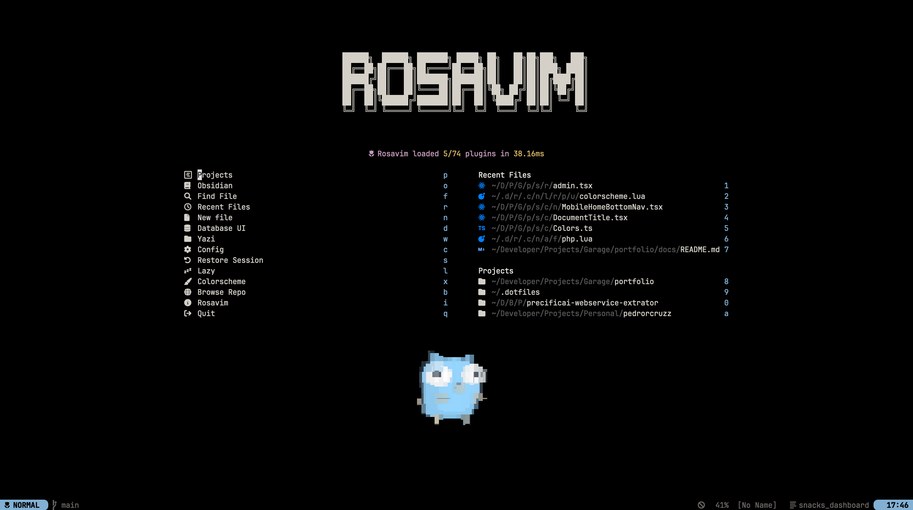
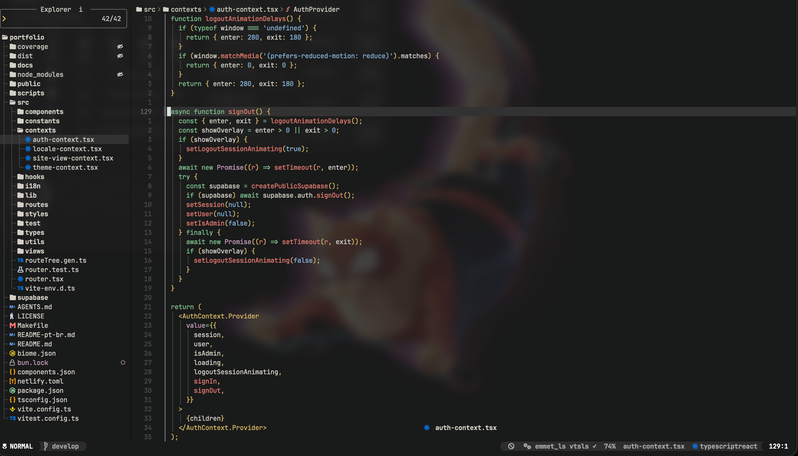

<div align="center">


# Rosavim

**A modern, productive Neovim distribution ready for the real world.**

[](https://neovim.io)
[](https://www.lua.org)
[](LICENSE)

---

*Turn your terminal into a full-featured IDE, no hassle.*

🇺🇸 **[English](#what-is-rosavim)** | 🇧🇷 **[Português](README.pt-br.md)**

[What is Rosavim?](#what-is-rosavim) · [Built-in Themes](#built-in-themes) · [Documentation](#documentation) · [Languages](#languages--frameworks) · [Features](#features) · [Installation](#installation) · [Requirements](#requirements) · [Project Structure](#project-structure) · [Key Shortcuts](#key-shortcuts)

| | |
|:---:|:---:|
|  |  |
|  |  |

</div>

## What is Rosavim?

Rosavim is a Neovim distribution built for developers who want a complete, fast, and beautiful development environment without spending hours configuring from scratch. With first-class support for the most popular languages and frameworks, just clone and start coding.

Built on top of **Lazy.nvim**, Rosavim loads **70+ plugins** intelligently, keeping startup fast and the experience smooth.

## Documentation

For detailed guides and complete references, check the [docs/manual](docs/manual/) directory:

- **[Installation](docs/manual/installation.md)** — Complete installation guide with troubleshooting
- **[Keybindings](docs/manual/keybinds.md)** — Complete keybinding reference with usage examples
- **[Plugins](docs/manual/plugins.md)** — Full plugin catalog with descriptions
- **[Languages](docs/manual/languages.md)** — Language support details and configuration
- **[Debugging](docs/manual/debugging.md)** — Debug setup and usage per language
- **[Customization](docs/manual/customization.md)** — Themes, appearance, and how to extend Rosavim
- **[Toggles](docs/manual/toggles.md)** — Persistent UI toggles across sessions

## Languages & Frameworks

Rosavim ships with full support (LSP, formatting, linting, testing, and debugging) for the most popular development stacks:

| Language | LSP | Formatter | Linter | Tests | Debug |
|:---------|:---:|:---------:|:------:|:-----:|:-----:|
| **TypeScript / JavaScript** | vtsls | Biome / Prettier | ESLint / Biome | Jest / Vitest | — |
| **React / JSX / TSX** | vtsls | Biome / Prettier | ESLint / Biome | Jest / Vitest | — |
| **Go** | gopls | goimports | golangci-lint | gotestsum | Delve |
| **Python** | Pyright | autopep8 | Mypy / Pylint | pytest | debugpy |
| **Java** | JDTLS | google-java-format | Checkstyle | Gradle | Remote Attach |
| **PHP / Laravel** | Intelephense | php-cs-fixer | phpcs | Pest | Xdebug |
| **HTML / CSS** | Emmet + Tailwind CSS | Prettier | djlint | — | — |
| **SQL** | sqlls | sql_formatter | — | — | — |
| **Lua** | lua_ls | StyLua | — | — | — |
| **JSON** | json_ls | Prettier | Biome | — | — |

> **Not listed here?** Rosavim uses **Mason** as its tooling backbone — adding support for new languages is as simple as installing the LSP server, formatter, or linter you need. Rust, C/C++, Kotlin, Ruby, Elixir, Zig, and many more can be set up in minutes.

## Features

### Smart Editor

- **Autocompletion** via [blink.cmp](https://github.com/Saghen/blink.cmp) — Rust-powered completion engine, blazingly fast
- **Snippets** with LuaSnip + friendly-snippets for maximum productivity
- **Treesitter** for precise syntax highlighting, text objects, and code context
- **Format on Save** with conform.nvim
- **Auto Save** on focus loss
- **Persistent Toggles** — all UI and autocmd settings are saved across sessions with runtime toggle support

### Navigation & Search

- **Snacks Picker** for fuzzy finding files, grep, buffers, and much more
- **Flash.nvim** for lightning-fast code navigation with visual labels
- **Rosapoon** to bookmark and jump between frequently used files (visual select delete, bulk remove)
- **Snacks Explorer** as an integrated file tree
- **Yazi** as an alternative terminal file manager
- **Rosapreview** to preview LSP definitions, type definitions, implementations, and references in a floating window — expand to vsplit or replace the current window
- **GrugFar** for advanced search & replace powered by ripgrep

### Git

- **Gitsigns** with inline change indicators and per-line git blame
- Built-in **lazygit** integration

### Debug & Testing

- **DAP** (Debug Adapter Protocol) with visual UI, breakpoints, and inline variable inspection
- **Rosatest** — Rosavim's built-in test runner with a popup UI for results, run nearest/file/all tests, and a test file picker. Supports Go, Jest, Vitest, Pytest, Pest, PHPUnit, and Java

### AI

- **GitHub Copilot** integrated into autocompletion
- **Sidekick** as an AI assistant in the editor

### UI & Appearance

- **4 colorschemes** included: **Rosamin** (default, inspired by min-theme), **Rosaesthetic** (built-in), Catppuccin, and Gruvbox
- **2 built-in themes** (Rosamin & Rosaesthetic) with dark/light mode, transparency support, and custom overrides
- **Dark/light mode** toggle with a single shortcut
- **Transparent mode** to blend with your terminal wallpaper
- Custom **dashboard** with quick access to projects and recent files
- **Lualine** statusline with mode, git, LSP, and Copilot info
- **Bufferline** buffer tab bar with diagnostics, pick, and sorting (toggleable)
- **Dropbar** breadcrumbs for navigation
- **Incline** floating filename indicator per window (toggleable)
- **Noice.nvim** for modern messages and command line
- **Rosamaximize** — built-in window maximizer (`<leader>cm`). Toggle to maximize the current window and restore the full layout

### File Management

- **Rosafile** — Rosavim's built-in file operations menu (`<leader>x`). Create, rename, duplicate, delete files, and view file info — all from a clean popup UI

### Language Tools

- **Rosakit** — Language-aware project navigator. Detects your stack automatically (React, Next.js, Vue, Angular, Svelte, Nest.js, Express, Go, Django, FastAPI, Laravel, Spring) and shows relevant project sections (components, controllers, models, routes, etc.) plus LSP tools. Supports monorepos with multiple stacks

### Extra Tools

- **Database Client** (vim-dadbod) with UI for SQL queries
- **Obsidian** integration for notes and second brain
- **Discord Presence** to show what you're editing
- **CodeSnap** for beautiful code screenshots
- **ToggleTerm** for floating and split terminals

> These are just the built-in tools. Rosavim's plugin system is modular — you can easily add, remove, or swap plugins to match your workflow.

## Built-in Themes

Rosavim ships with its own themes, fully integrated with dark/light mode and transparency toggles.

### Rosamin (default)

Minimal aesthetic theme inspired by min-theme. Clean and focused.

| Code (Dark) | Dashboard (Dark) | Code (Light) | Transparent |
|:------------|:-----------------|:-------------|:------------|
|  |  |  |  |

### Rosaesthetic

Warm, earthy aesthetic theme with rich tones.

| Code (Dark) | Dashboard (Dark) | Code (Light) | Dashboard (Light) | Transparent |
|:------------|:-----------------|:-------------|:-------------------|:------------|
|  |  |  |  |  |

## Installation

```bash
# Back up your current config (if any)
mv ~/.config/nvim ~/.config/nvim.bak

# Clone Rosavim
git clone https://github.com/pedrorcruzz/rosavim.git ~/.config/nvim

# Launch Neovim — plugins install automatically
nvim
```

On the first launch, **Lazy.nvim** will install all plugins and **Mason** will set up LSP servers, formatters, linters, and debug adapters.

> For a complete step-by-step guide (backup, dependencies, troubleshooting), see the **[Installation Manual](docs/manual/installation.md)**.

## Requirements

| Dependency | Version |
|:-----------|:--------|
| **Neovim** | **>= 0.12** |
| Git | >= 2.19 |
| Node.js | >= 18 |
| Python | >= 3.10 |
| [Nerd Font](https://www.nerdfonts.com/) | Any |
| [ripgrep](https://github.com/BurntSushi/ripgrep) | Any |

### Recommended

- [lazygit](https://github.com/jesseduffield/lazygit) — Terminal Git UI
- [yazi](https://github.com/sxyazi/yazi) — Terminal file manager
- [chafa](https://hpjansson.org/chafa/) — Terminal image display (used in the dashboard)

## Project Structure

```
~/.config/nvim/
├── init.lua                          # Entry point
├── lua/rosavim/
│   ├── init.lua                      # Bootstrap
│   ├── config/
│   │   ├── options.lua               # Neovim options
│   │   ├── keybinds.lua              # Global mappings
│   │   ├── appearance.lua            # Theme, transparency, dark/light
│   │   ├── autocmds.lua              # Autocommands
│   │   ├── filetypes.lua             # Filetype detection
│   │   └── snippets/                 # Custom snippets
│   ├── plugins/
│   │   ├── env/                      # LSP, Mason, Treesitter, DAP, Lint, Format
│   │   ├── ai/                       # Copilot, Sidekick
│   │   ├── ui/                       # Themes, statusline, dashboard
│   │   ├── editor/                   # Terminal, navigation, Rosafile
│   │   ├── coding/                   # Surround, multi-cursor, refactoring
│   │   ├── language/                 # Language-specific (Laravel, Java, etc.)
│   │   └── test/                     # Rosatest, Rosakit
│   ├── rosa_plugins/
│   │   ├── rosatest/                 # Built-in test runner (Go, Jest, Vitest, Pytest, Pest, Java)
│   │   ├── rosafile/                 # Built-in file operations (create, rename, duplicate, delete)
│   │   ├── rosapick/                 # Built-in visual window picker
│   │   ├── rosapreview/              # Built-in LSP preview in floating windows
│   │   ├── rosamaximize/             # Built-in window maximizer (maximize/restore layout)
│   │   ├── rosasave/                 # Built-in auto-save with debounce
│   │   ├── rosasweep/                # Built-in automatic buffer sweeper (closes inactive buffers)
│   │   └── rosakit/                  # Language-aware project navigator
│   └── rosa_themes/
│       ├── rosamin/                  # Built-in theme: Rosamin (default, inspired by min-theme)
│       └── rosaesthetic/             # Built-in theme: Rosaesthetic (earthy, warm aesthetic)
├── lsp/                              # Individual LSP configurations
└── assets/                           # Logo and visual resources
```

## Key Shortcuts

> Leader key: `<Space>`

| Shortcut | Action |
|:---------|:-------|
| `<leader>e` | File Explorer |
| `<leader>y` | Yazi File Manager |
| `<leader>fp` | Discover Projects |
| `<leader><space>` | Find Files |
| `<leader>sg` | Live Grep |
| `<leader>lf` | Format File |
| `<leader>nn` | Rosatest Menu |
| `<leader>nf` | Run File Tests |
| `gp` | Rosapreview Definition |
| `<leader>kk` | Rosakit Menu |
| `<leader>xx` | Rosafile Menu |
| `<leader>cm` | Rosamaximize |
| `<leader>ds` | Start/Continue Debug |
| `<leader>db` | Toggle Breakpoint |
| `<leader>gt` | Git Line Blame |
| `<leader>lqt` | Toggle Dark/Light Mode |
| `<leader>lqs` | Switch Colorscheme |
| `<C-\>` | Floating Terminal |
| `s` | Flash Jump |
| `kj` | Exit Insert Mode |

> Press `<leader>` to open **which-key** and explore all available shortcuts.

---

<div align="center">

Built with care by **Pedro Rosa**

</div>
