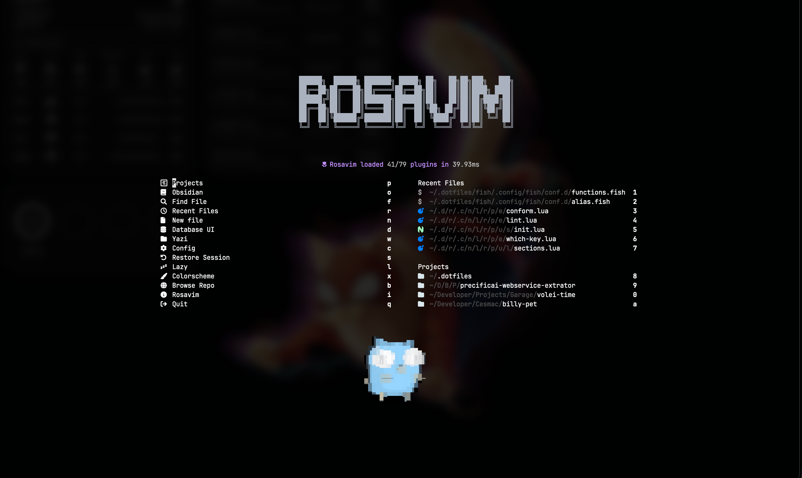
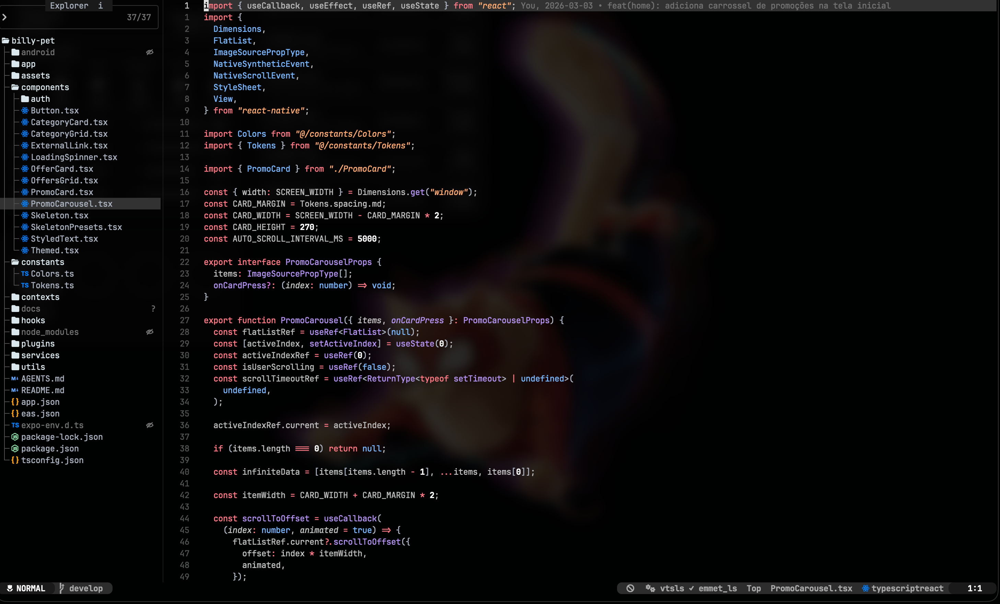
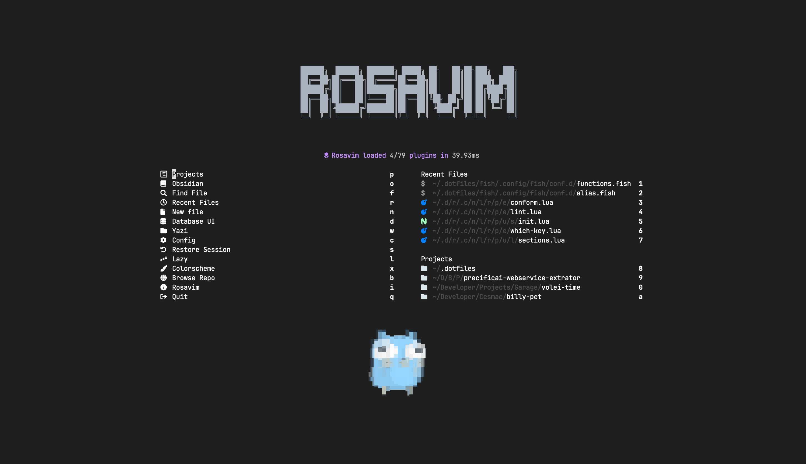
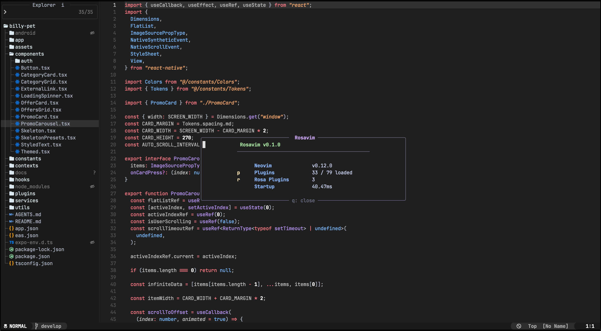
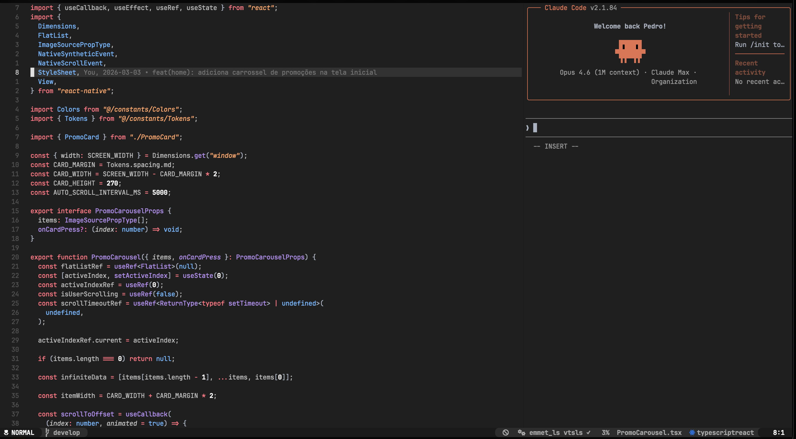
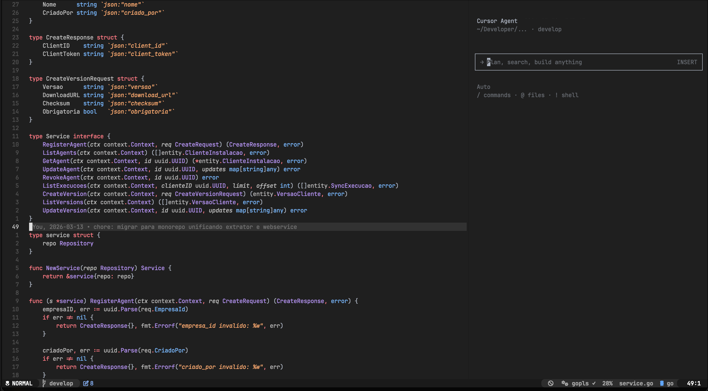

<div align="center">


# Rosavim

**Uma distribuição Neovim moderna, produtiva e pronta para o mundo real.**

[](https://neovim.io)
[](https://www.lua.org)
[](LICENSE)

---

*Transforme seu terminal em uma IDE completa, sem complicações.*

🇺🇸 **[English](README.md)** | 🇧🇷 **[Português](#o-que-é-rosavim)**

[O que é Rosavim?](#o-que-é-rosavim) · [Documentação](#documentação) · [Linguagens](#linguagens--frameworks) · [Funcionalidades](#funcionalidades) · [Instalação](#instalação) · [Requisitos](#requisitos) · [Estrutura do Projeto](#estrutura-do-projeto) · [Atalhos Principais](#atalhos-principais)

| | |
|:---:|:---:|
|  |  |
|  |  |
|  |  |

</div>

## O que é Rosavim?

Rosavim é uma distribuição do Neovim pensada para desenvolvedores que querem um ambiente de desenvolvimento completo, rápido e bonito sem precisar gastar horas configurando do zero. Com suporte de primeira classe para as principais linguagens e frameworks do mercado, basta clonar e começar a codar.

Construída sobre o **Lazy.nvim**, Rosavim carrega mais de **75+ plugins** de forma inteligente, mantendo o startup rápido e a experiência fluida.

## Documentação

Para guias detalhados e referências completas, confira o diretório [docs/manual](docs/manual/):

- **[Instalação](docs/manual/installation.pt-br.md)** — Guia completo de instalação com troubleshooting
- **[Atalhos](docs/manual/keybinds.pt-br.md)** — Referência completa de atalhos com exemplos de uso
- **[Plugins](docs/manual/plugins.pt-br.md)** — Catálogo completo de plugins com descrições
- **[Linguagens](docs/manual/languages.pt-br.md)** — Detalhes de suporte a linguagens e configuração
- **[Debugging](docs/manual/debugging.pt-br.md)** — Configuração e uso de debug por linguagem
- **[Customização](docs/manual/customization.pt-br.md)** — Temas, aparência e como estender o Rosavim
- **[Toggles](docs/manual/toggles.pt-br.md)** — Persistência de toggles de interface entre sessões

## Linguagens & Frameworks

Rosavim oferece suporte completo (LSP, formatação, linting, testes e debug) para as principais stacks de desenvolvimento:

| Linguagem | LSP | Formatter | Linter | Testes | Debug |
|:----------|:---:|:---------:|:------:|:------:|:-----:|
| **TypeScript / JavaScript** | vtsls | Biome / Prettier | ESLint / Biome | Jest / Vitest | — |
| **React / JSX / TSX** | vtsls | Biome / Prettier | ESLint / Biome | Jest / Vitest | — |
| **Go** | gopls | goimports | golangci-lint | gotestsum | Delve |
| **Python** | Pyright | autopep8 | Mypy / Pylint | pytest | debugpy |
| **Java** | JDTLS | google-java-format | Checkstyle | Gradle | Remote Attach |
| **PHP / Laravel** | Intelephense | php-cs-fixer | phpcs | Pest | Xdebug |
| **HTML / CSS** | Emmet + Tailwind CSS | Prettier | djlint | — | — |
| **SQL** | sqlls | sql_formatter | — | — | — |
| **Lua** | lua_ls | StyLua | — | — | — |
| **JSON** | json_ls | Prettier | Biome | — | — |

> **Não encontrou sua linguagem?** Rosavim usa o **Mason** como backbone de ferramentas — adicionar suporte a novas linguagens é tão simples quanto instalar o LSP server, formatter ou linter que você precisa. Rust, C/C++, Kotlin, Ruby, Elixir, Zig e muitas outras podem ser configuradas em minutos.

## Funcionalidades

### Editor Inteligente

- **Autocompletion** via [blink.cmp](https://github.com/Saghen/blink.cmp) — engine de completion em Rust, extremamente rápido
- **Snippets** com LuaSnip + friendly-snippets para produtividade máxima
- **Treesitter** para syntax highlighting preciso, text objects e contexto de código
- **Format on Save** automático com conform.nvim
- **Auto Save** ao perder foco da janela
- **Toggles Persistentes** — todas as configurações de UI e autocmd são salvas entre sessões com toggle em runtime

### Navegação & Busca

- **Snacks Picker** para fuzzy finding de arquivos, grep, buffers e muito mais
- **Flash.nvim** para movimentação rápida no código com labels visuais
- **Rosapoon** para marcar e saltar entre arquivos frequentes (seleção visual para deletar, remoção em massa)
- **Snacks Explorer** como file tree integrado
- **Yazi** como file manager alternativo no terminal
- **Rosapreview** para preview de definições LSP, type definitions, implementações e referências em janela flutuante — expanda para vsplit ou substitua a janela atual
- **GrugFar** para search & replace avançado com ripgrep

### Git

- **Gitsigns** com indicadores de mudanças inline e git blame por linha
- Integração com **lazygit** direto do editor

### Debug & Testes

- **DAP** (Debug Adapter Protocol) com UI visual, breakpoints e inspeção de variáveis inline
- **Rosatest** — test runner nativo do Rosavim com popup de resultados, roda testes nearest/file/all e picker de arquivos de teste. Suporte para Go, Jest, Vitest, Pytest, Pest, PHPUnit e Java

### IA

- **GitHub Copilot** integrado ao autocompletion
- **Sidekick** como assistente de IA no editor

### UI & Aparência

- **7 colorschemes** incluídos: Catppuccin, Gruvbox, Kanagawa, Min Theme, Rosé Pine, Rusticated e Vesper
- Alternância entre **dark/light mode** com um atalho
- **Modo transparente** para integrar com o wallpaper do terminal
- **Dashboard** customizado com acesso rápido a projetos e arquivos recentes
- **Lualine** com statusline informativa (modo, git, LSP, Copilot)
- **Dropbar** com breadcrumbs de navegação
- **Incline** indicador flutuante de nome de arquivo por janela (com toggle)
- **Noice.nvim** para mensagens e command line modernos

### Gerenciamento de Arquivos

- **Rosafile** — menu nativo de operações com arquivos (`<leader>x`). Crie, renomeie, duplique, delete arquivos e veja informações — tudo via popup

### Ferramentas de Linguagem

- **Rosakit** — Navegador de projeto com detecção de stack. Detecta automaticamente o stack (React, Next.js, Vue, Angular, Svelte, Nest.js, Express, Go, Django, FastAPI, Laravel, Spring) e mostra seções relevantes (components, controllers, models, routes, etc.) + ferramentas LSP. Suporta monorepos

### Ferramentas Extras

- **Database Client** (vim-dadbod) com UI para queries SQL
- **Obsidian** integração para notas e second brain
- **Discord Presence** para mostrar o que você está editando
- **CodeSnap** para screenshots bonitos do código
- **ToggleTerm** para terminais flutuantes e splits

> Essas são apenas as ferramentas que já vem inclusas. O sistema de plugins do Rosavim é modular — você pode facilmente adicionar, remover ou trocar plugins para adaptar ao seu workflow.

## Instalação

```bash
# Faça backup da sua config atual (se houver)
mv ~/.config/nvim ~/.config/nvim.bak

# Clone o Rosavim
git clone https://github.com/pedrorcruzz/rosavim.git ~/.config/nvim

# Abra o Neovim — os plugins instalam automaticamente
nvim
```

Na primeira execução, o **Lazy.nvim** instalará todos os plugins e o **Mason** configurará os LSP servers, formatters, linters e adaptadores de debug.

> Para um guia completo passo a passo (backup, dependências, troubleshooting), veja o **[Manual de Instalação](docs/manual/installation.pt-br.md)**.

## Requisitos

| Dependência | Versão |
|:------------|:-------|
| **Neovim** | **>= 0.12** |
| Git | >= 2.19 |
| Node.js | >= 18 |
| Python | >= 3.10 |
| [Nerd Font](https://www.nerdfonts.com/) | Qualquer |
| [ripgrep](https://github.com/BurntSushi/ripgrep) | Qualquer |

### Recomendado

- [lazygit](https://github.com/jesseduffield/lazygit) — UI de Git no terminal
- [yazi](https://github.com/sxyazi/yazi) — File manager no terminal
- [chafa](https://hpjansson.org/chafa/) — Imagens no terminal (usado no dashboard)

## Estrutura do Projeto

```
~/.config/nvim/
├── init.lua                          # Ponto de entrada
├── lua/rosavim/
│   ├── init.lua                      # Bootstrap
│   ├── config/
│   │   ├── options.lua               # Opções do Neovim
│   │   ├── keybinds.lua              # Mapeamentos globais
│   │   ├── appearance.lua            # Tema, transparência, dark/light
│   │   ├── autocmds.lua              # Autocommands
│   │   ├── filetypes.lua             # Detecção de filetypes
│   │   └── snippets/                 # Snippets customizados
│   └── plugins/
│       ├── env/                      # LSP, Mason, Treesitter, DAP, Lint, Format
│       ├── ai/                       # Copilot, Sidekick
│       ├── ui/                       # Temas, statusline, dashboard
│       ├── editor/                   # Terminal, navegação, Rosafile
│       ├── coding/                   # Surround, multi-cursor, refactoring
│       ├── language/                 # Suporte específico (Laravel, Java, etc.)
│       └── test/                     # Rosatest, Rosakit
│   └── rosa_plugins/
│       ├── rosatest/                 # Test runner nativo (Go, Jest, Vitest, Pytest, Pest, Java)
│       ├── rosafile/                 # Operações de arquivos (criar, renomear, duplicar, deletar)
│       ├── rosapick/                 # Seletor visual de janelas
│       ├── rosapreview/              # Preview LSP em janelas flutuantes
│       ├── rosasave/                 # Salvamento automático com debounce
│       ├── rosasweep/                # Varredor automático de buffers inativos
│       └── rosakit/                  # Navegador de projeto com detecção de stack
├── lsp/                              # Configurações individuais de LSP
└── assets/                           # Logo e recursos visuais
```

## Atalhos Principais

> Leader key: `<Space>`

| Atalho | Ação |
|:-------|:-----|
| `<leader>e` | File Explorer |
| `<leader>y` | Yazi File Manager |
| `<leader>fp` | Descobrir Projetos |
| `<leader><space>` | Buscar Arquivos |
| `<leader>sg` | Grep ao Vivo |
| `<leader>lf` | Formatar Arquivo |
| `<leader>nn` | Menu Rosatest |
| `<leader>nf` | Rodar Testes do Arquivo |
| `<leader>xx` | Menu Rosafile |
| `gp` | Rosapreview Definição |
| `<leader>kk` | Menu Rosakit |
| `<leader>ds` | Iniciar/Continuar Debug |
| `<leader>db` | Toggle Breakpoint |
| `<leader>gt` | Git Blame da Linha |
| `<leader>lqt` | Alternar Dark/Light Mode |
| `<leader>lqs` | Trocar Colorscheme |
| `<C-\>` | Terminal Flutuante |
| `s` | Flash Jump |
| `kj` | Sair do Insert Mode |

> Pressione `<leader>` para abrir o **which-key** e explorar todos os atalhos disponíveis.

---

<div align="center">

Construído com carinho por **Pedro Rosa**

</div>
